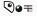

# Dotted 

## Let’s make point

Dotted est un logiciel de prise de
note comme l’ont pû être Notion ou
Obsidian, mais plus spécifique au
besoins de sa créatrice.

#### FEATURES

- Interface web
  - Blocks élémentaires
  - Gestion des pages
- API

#### ARCHITECTURE

##### Web

Interface web développée avec [Vite](https://vite.dev/) + [React](https://fr.react.dev/) + [TypeScript](https://www.typescriptlang.org/) + [Sass](https://sass-lang.com/).

##### Backend

API développée avec [FastAPI](https://fastapi.tiangolo.com/) ([Python](https://www.python.org/)).

##### Base de données

[PostgreSQL](https://www.postgresql.org/) pour la persistance des données.

##### Infrastructure

L’ensemble est conteneurisé avec [Docker](https://www.docker.com/) pour le développement et la production.

#### INSTALLATION RAPIDE

Dans un premier terminal

```bash
git clone https://github.com/3x0De/Dotted-back.git
cd Dotted-back
docker compose up --build
```

Dans un second terminal

```bash
git clone https://github.com/3x0De/Dotted-web.git
cd Dotted-web
npm install
npm run dev
```

#### Repos

- [App web](https://github.com/3x0De/Dotted-web)
- [Backend](https://github.com/3x0De/Dotted-back)

#### Configuration globale

Frontend: http://localhost:5173  
Backend: http://localhost:8000

#### Documentation

- [Charte graphique](https://github.com/3x0De/Dotted-docs/Charte.pdf)
- [Installation](https://github.com/3x0De/Dotted-docs/INSTALLATION.md)
- [Architecture](https://github.com/3x0De/Dotted-docs/ARCHITECTURE.md)
- [Developement](https://github.com/3x0De/Dotted-docs/DEVELOPMENT.md)
- [Deployment](https://github.com/3x0De/Dotted-docs/DEVELOPEMENT.md)
- [Changelog](https://github.com/3x0De/Dotted-docs/CHANGELOG.md)
  - [Web](https://github.com/3x0De/Dotted-web/CHANGELOG.md)
  - [Backend](https://github.com/3x0De/Dotted-back/CHANGELOG.md)
- [Licence](https://github.com/3x0De/Dotted-docs/LICENSE)
- [FAQ](https://github.com/3x0De/Dotted-docs/FAQ.md)
